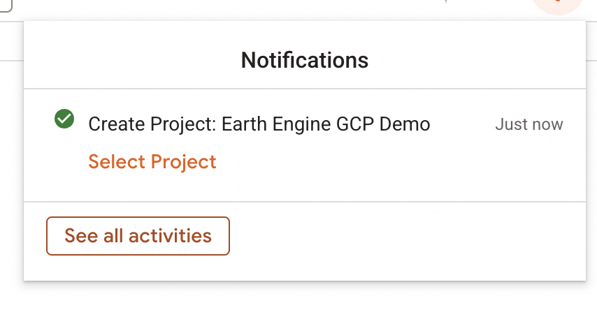
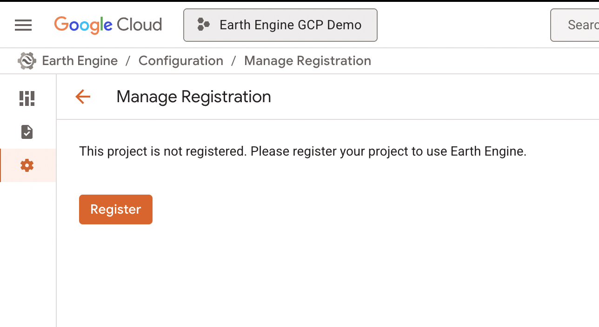
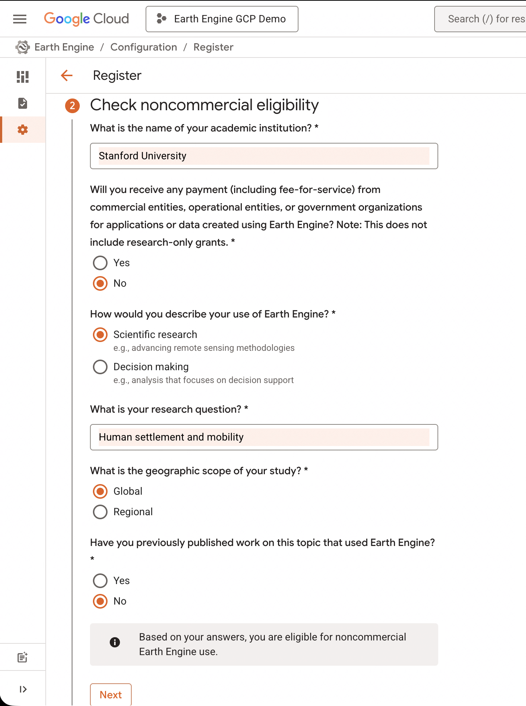
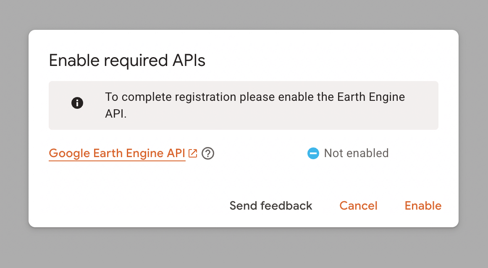
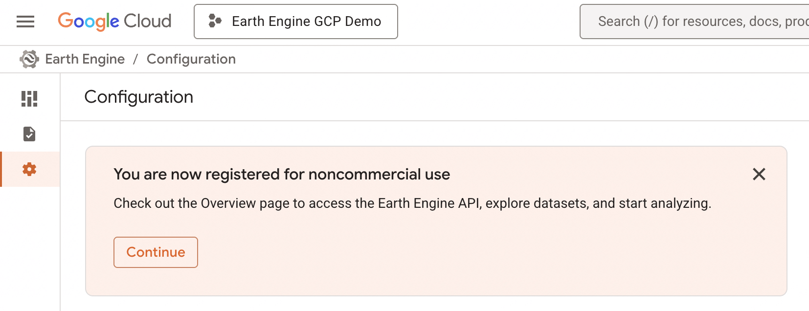

# Getting Started with Google Earth Engine on Google Cloud

### A Student Guide to Creating a GCP Project, Registering it for Earth Engine, and Enabling the API

---

## 🧭 Introduction

Google Earth Engine (GEE) is a powerful geospatial analysis platform that allows you to analyze and visualize satellite data at scale using cloud computing. When combined with **Google Cloud Platform (GCP)**, it offers:

* 🔓 Access to the full **Earth Engine REST API** and **Python client**
* 📁 Better project-level organization of scripts, resources, and datasets
* 👥 Support for secure, collaborative development environments

If you're a **student**, you're eligible to create **GCP projects specifically for Earth Engine** — even **without a billing account**. These GCP projects:

✅ Allow access to the full GEE Python and REST APIs
✅ Are free for noncommercial academic use
✅ Do **not** require billing
❌ Cannot be used with other Google Cloud APIs that require billing

This tutorial walks you through:

1. Creating a new GCP project
2. Registering the project for **noncommercial use**
3. Enabling the **Earth Engine API**
4. Verifying access to the Earth Engine Code Editor and APIs

---

## 🧑‍💻 Step 1: Sign In and Create a New GCP Project

1. Go to the [Google Cloud Console](https://console.cloud.google.com/)

2. Click the **project dropdown** in the top toolbar

3. Click **"Register a new Cloud Project"** under your account menu:

   

4. In the **New Project** screen, fill in:

   * **Project Name:** e.g., `Earth Engine GCP Demo`
   * **Location:** e.g., `GEE Student Projects`

   

5. Click **Create**

6. You’ll see a success notification:

   

---

## 📝 Step 2: Register the Project for Earth Engine Use

Once your GCP project is created, you need to **register it with Earth Engine**.

1. Navigate to the **Earth Engine Configuration** panel:
   [https://console.cloud.google.com/earthengine](https://console.cloud.google.com/earthengine)

2. If prompted, click **Register** under the **Manage Registration** tab:

   

3. Fill in the **noncommercial eligibility form**:

   * Institution name (e.g., Stanford University)
   * Confirm that you will not receive commercial payment
   * Select **Scientific Research** as your use case
   * Enter a research question (e.g., *Human settlement and mobility*)
   * Choose **Global** scope
   * Indicate whether you've previously published using Earth Engine

   ✅ You'll see a note that confirms your eligibility:

   

4. Click **Next** to complete the registration.

---

## 🔓 Step 3: Enable the Earth Engine API

After registration, you’ll need to **enable the Earth Engine API** in your project.

1. If you see this prompt, click **Enable**:

   

2. Wait a few seconds until the status changes to enabled.

---

## ✅ Step 4: Confirm Your Registration

After enabling the API, you should see a message confirming that you're **registered for noncommercial use**:

You can now access:

* The **Earth Engine Code Editor**: [https://code.earthengine.google.com](https://code.earthengine.google.com)
* The **Python and REST APIs** from Jupyter, Colab, or your local environment

To confirm your access, open the Earth Engine Code Editor and check the **Console tab** for the welcome message:

---

## 🚀 You’re Ready to Go!

You now have:

* A GCP project set up specifically for Earth Engine
* Earth Engine API enabled
* Access to GEE’s Python and REST interfaces

You can now start building and running geospatial analyses using Earth Engine in:

* Python (via [`earthengine-api`](https://developers.google.com/earth-engine/python_install))
* Google Colab or Jupyter Notebooks
* Earth Engine Code Editor (for JavaScript scripting)

---

## 🧠 Tips for Students

* **No billing needed**: These projects are sandboxed for Earth Engine only
* **Use GCP Projects to organize your work**: One project per class or research study is a good practice
* **Need collaboration?**: Add collaborators under IAM settings of your GCP project
* **Run out of projects?**: You can request more quota if you need more than 10 (default limit)

---

## 🧰 Resources

* 🌐 [Google Earth Engine Documentation](https://developers.google.com/earth-engine)
* 💻 [Earth Engine Python API Guide](https://developers.google.com/earth-engine/python_install)
* 📁 [GCP Projects Overview](https://cloud.google.com/resource-manager/docs/creating-managing-projects)

